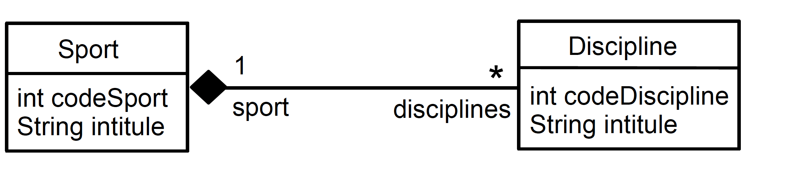

# TP JPA - Partie I

## Prerequis
- Eclipse 
- Widfly 27
- JDK 17


## Informations
Veuillez cloné ce projet et vous en inspirez pour créer le votre.Dans cette première partie nous gérons la création d'un sport.Les éléments abordés sont les suivants :
- Templating avec JSP
- Servlet
- JPA
La base de données utilisée est une base H2 embarqué avec le serveur Widfly

### Implementation du cas d'utilisation OneToMany et ManyToOne




### I - Configuration du projet

NB : Pour les éléments de configuration du projet veuillez vous réferer à ce tp : https://github.com/andresetevejob/jee-formations/blob/main/tp-helloworld.md
#### 1 - sous eclipse créer un nouveau projet maven.
Avec les informations suivantes :

- groupId : com.nextu.jakartaee
- artifactId: sample-jpa
- package : war

#### 2 - Remplacer  le contenu de votre fichier pom.xml par celui-ci 
````
<project xmlns="http://maven.apache.org/POM/4.0.0" xmlns:xsi="http://www.w3.org/2001/XMLSchema-instance" xsi:schemaLocation="http://maven.apache.org/POM/4.0.0 https://maven.apache.org/xsd/maven-4.0.0.xsd">
  <modelVersion>4.0.0</modelVersion>
  <groupId>com.nextu.jakartaee</groupId>
  <artifactId>sample-jpa</artifactId>
  <version>0.0.1-SNAPSHOT</version>
  <properties>
     <project.build.sourceEncoding>UTF-8</project.build.sourceEncoding>
     <project.reporting.outputEncoding>UTF-8</project.reporting.outputEncoding>
     <maven.compiler.source>17</maven.compiler.source>
     <maven.compiler.target>17</maven.compiler.target>
     <failOnMissingWebXml>false</failOnMissingWebXml>
  </properties>
  <dependencies>
  <dependency>
       <groupId>jakarta.platform</groupId>
       <artifactId>jakarta.jakartaee-api</artifactId>
       <version>10.0.0</version>
       <scope>provided</scope>
  </dependency>
  </dependencies>
  <build>
    <plugins>
    	 <plugin>
          <artifactId>maven-war-plugin</artifactId>
          <version>3.2.2</version>
        </plugin>
    </plugins>
  </build>
</project>
````

#### 3 - Créer un fichier persistence.xml dans le dossier META-INF de votre projet et remplacer son contenu par celui-ci. Ce fichier permet la configuration de votre EntityManager JPA

````
<?xml version="1.0" encoding="UTF-8" standalone="yes"?>
<persistence xmlns="https://jakarta.ee/xml/ns/persistence"
             xmlns:xsi="http://www.w3.org/2001/XMLSchema-instance"
             xsi:schemaLocation="https://jakarta.ee/xml/ns/persistence https://jakarta.ee/xml/ns/persistence/persistence_3_1.xsd"
             version="3.1">
   <persistence-unit name="sample-jpa">
        <jta-data-source>java:jboss/datasources/ExampleDS</jta-data-source>
        
        <provider>org.hibernate.jpa.HibernatePersistenceProvider</provider>
        <properties>
                <!-- AUTO-GENERATES DATABASE FROM ANNOTATIONS METADATA -->
                 <property name="javax.persistence.schema-generation.database.action" value="drop-and-create"/>
                 <property name="javax.persistence.schema-generation.create-source"  value="metadata"/>
                 <property name="javax.persistence.schema-generation.drop-source" value="metadata"/>
                 <property name="hibernate.hbm2ddl.auto" value="create-drop" />
                 <property name="hibernate.show_sql" value="true" />
        </properties>
   </persistence-unit>
</persistence>

````

#### 4 - Création des packages
Dans votre projet créer les packages suivants :
 -    com.nextu.controllers (Contiendra les servlets)
 -    com.nextu.entities (Contiendra les entités JPA)

#### 5 - Servlets
Différentes Servlets ont été créees afin de gérer la création, la modification et la suppression d'un sport

- Injection de dépendance :
````
  
  @PersistenceContext(unitName = "sample-jpa")
   private EntityManager em;
````
Le code ci-dessus permet d'injecter dans notre Servlet l'entityManager qui se chargera de sauvegarder les entités dans la base de données

- Injection de l'objet chargé de gérer la transaction
````
   @Resource
   private UserTransaction userTransaction;
````

- Insertion d'un sport dans la base avec la gestion des transactions
````
            userTransaction.begin();
            Sport sport = new Sport();
            sport.setLibelle(libelle);
            em.persist(sport);
            transactionOk = true;

`````
Le code ci-dessus permet d'insérer un sport dans la base de données en gérant la transaction qui permettra un rollback en cas d'echec
